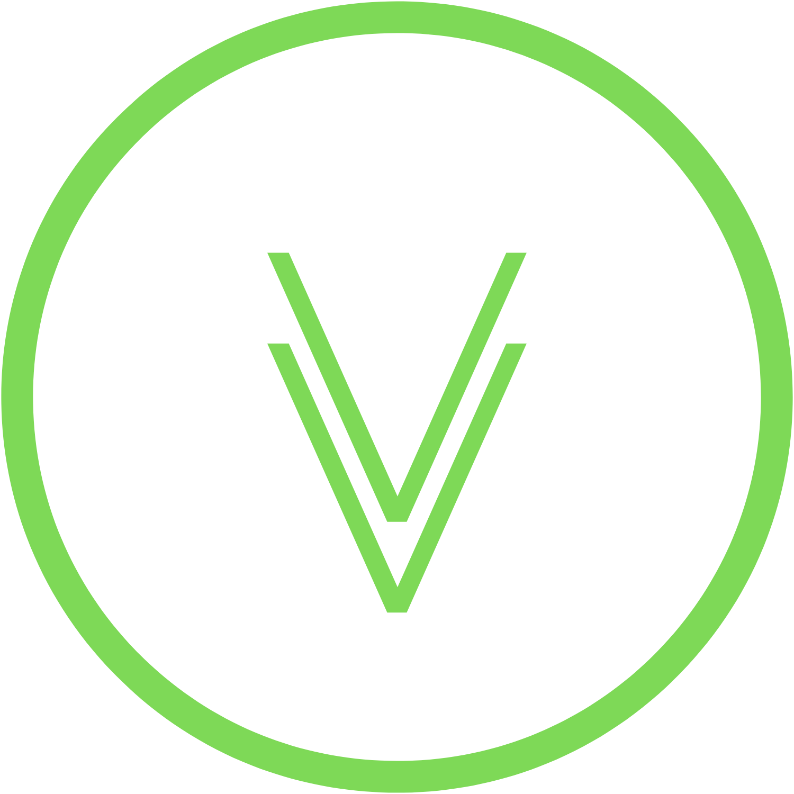

## Hi there 👋

### About me

My name is Nadin!

I'm currently working as Senior QA Engineer - SBER

:computer: I'm learning how to develop autotests

:envelope: You can contact me via telegram: <a target="_blank" href="https://t.me/nadin_qa">@nadin_qa</a>

### Tools and Technologies:

  <code></code>
  <code></code>
  <code></code>
  <code></code>
  <code></code>
  <code></code>
  <code></code>
  <code></code>
  <code></code>
  <code></code>
  <code></code>
  <code></code>
  <code></code>
  <code></code>

### Courses:
<table width="100%" border='0'>
    <tr><td width="10%" valign="bottom"></td><td valign="middle">Wexler.io Большой курс Python Practical Python Course: from basics to advanced</td></tr>
    <tr><td width="10%" valign="bottom"></td><td valign="middle">Stepik Автоматизация тестирования с помощью Selenium и Python </td></tr>
    <tr><td width="10%" valign="bottom"></td><td valign="middle">IT-Wizard Backend Automation QA Engineer и REST and GRPC API test automation</td></tr>
</table>

### Example of my autotest project:
<a target="_blank" href="https://github.com/NadezhdaDudnik/dm_api_tests">Проект для тестирования REST и gRPC API сервиса DM API Account</a>

### Certificates:
<a target="_blank" href="https://github.com/NadezhdaDudnik/NadezhdaDudnik/tree/main/Certificates">Полученные сертификаты</a>

### Hard skills:
- проведение функционального, интеграционного, регрессионного тестирования, тестирование веб и мобильных приложений, тестирование бизнес и платформенных сервисов, тестирование бэкенда;
- составление тестовой модели, постоянная актуализация тестовой модели;
- изучение бизнес-требований, спецификаций, архитектуры сервиса;
- работа с веб-сервисами, веб-приложениями;
- организация процессов ручного и автоматизированного тестирования, помощь бизнес-командам, проведение консультаций по организации процессов тестирования, внедрение введения тестовой модели;
- ведение проектной документации в Confluence;
- проведение процессов смоук и регрессионного тестирования, составление регресс прогонов для бизнеса-команд;
- принятие решений о готовности сборок бизнес-команд на приёмо-сдаточные испытания;
- заведение и валидация дефектов (JIRA);
- составление тестовой документации (требования к отчёту ИФТ, ТМ, рекомендации, инструкции по проектным задачам);
- коммуникация с бизнес-командами, с участниками разных проектов;
- обучение коллег, передача знаний, назначение задач, проведение консультаций;
- проведение ревью тестовых моделей;
- согласование отчётов ИФТ;
- помощь и консультация бизнес-командам;
- эксперт по платформенным сервисам единой фронтальной системы;
- наставничество;
- расстановка приоритетов по выполнению задач;
- работа с TM4J Adaptavist, HP ALM, Zephyr Scale;
- работа с Postman, Insomnia, DevTools;
- работа с базами данных PostregSQL, написание запросов SQL;
- помощь в построение процессов по тестированию бизнес-командам;
- выступаю в роли консультанта по тестированию;
- мониторинг данных в Grafana;
- работа с kibana, просмотр логов и метрик, понимание ELK, Kafka;
- занимаюсь менторством, введу блог про тестирование @protestinginfo
- обучаю людей тестированию ПО, за моей спиной больше 200 человек!
- изучаю Python, прохожу курсы по программированию и по автоматизации.